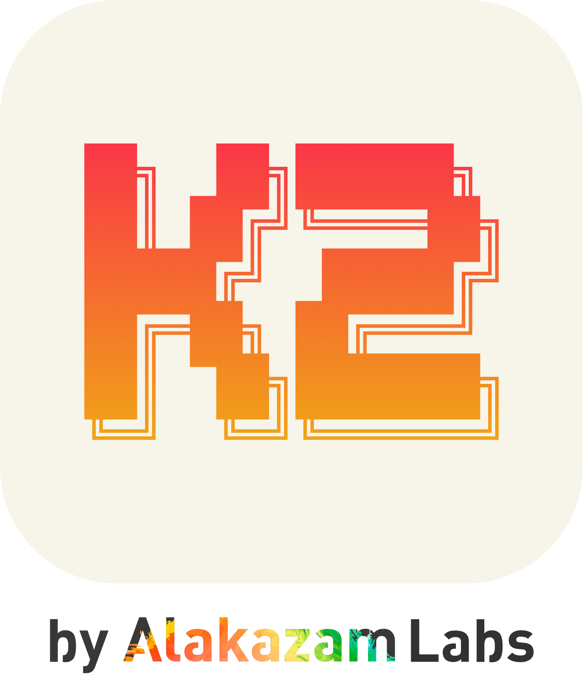

  <picture>
    <source media="(prefers-color-scheme: dark)" srcset="assets/brand/k2-lockup-light-text.png">
    
  </picture>

AI workspace orchestration — one daemon, many viewers; every workspace is an agent.

---

## 🚧 This is K2's new home

**K2** is the next chapter of the project previously known as **K2SO**.
The first release published here will be **v0.40.0**. Until then,
current releases live at
[Alakazam-211/K2SO](https://github.com/Alakazam-211/K2SO) — existing
installs will update to K2 automatically when 0.40.0 ships.

## Licensing — Fair Source

K2 is **[Fair Source](https://fair.io)** software, licensed under the
[Functional Source License (FSL-1.1-Apache-2.0)](./LICENSE.md):

- **Use it freely** — personally, on your team, in your company,
  commercially. Read every line. Modify it. Self-host it however you
  like.
- **Each version becomes Apache-2.0 open source two years after its
  release.**
- The one thing the license reserves: you can't offer K2 to others as
  a competing commercial product or service —
  **except** as allowed by the
  [Commercial Hosting Grant](./COMMERCIAL_HOSTING_GRANT.md), which lets
  anyone host K2 servers for clients via the official K2 Connect
  service.

The **"K2 by Alakazam Labs"** name and logo are covered by the
[trademark policy](./TRADEMARKS.md).

> Versions of K2SO up to and including 0.39.x were released under the
> MIT license and remain so.
