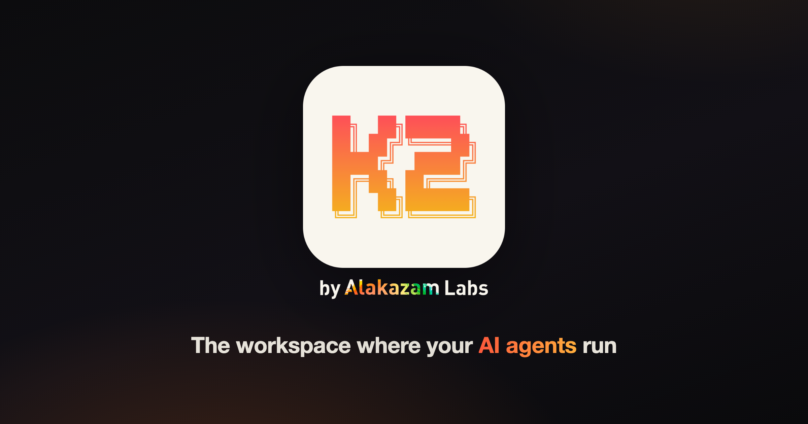

<p align="center">
  <a href="https://k2.dev">
    
  </a>
</p>

<p align="center">
  <a href="https://github.com/Alakazam-211/K2/blob/main/LICENSE.md"></a>
  <a href="https://k2.dev"></a>
  <a href="https://discord.gg/73b3sg6pSQ"></a>
  <a href="https://github.com/Alakazam-211/K2/releases"></a>
  <a href="https://github.com/Alakazam-211/K2/stargazers"></a>
  
  
</p>

<h1 align="center">K2</h1>

<p align="center">
  <strong>Multiplayer Agent Management Platform</strong><br/>
  <em>Agents as infrastructure.</em><br/>
  Host teams of agents that work together and run your business.
</p>

<p align="center">
  You don’t have to sit in the room for them to keep working.<br/>
  The <strong>daemon</strong> is the product — desktop, web, and phone are viewers.
</p>

<p align="center">
  <a href="https://github.com/Alakazam-211/K2/releases/latest"><strong>⬇ Download</strong></a>
  &nbsp;·&nbsp;
  <a href="https://k2.dev">Website</a>
  &nbsp;·&nbsp;
  <a href="https://discord.gg/73b3sg6pSQ">Discord</a>
  &nbsp;·&nbsp;
  <a href="WHATS_NEW.md">What's New</a>
  &nbsp;·&nbsp;
  <a href="https://k2.dev/docs/api">API</a>
  &nbsp;·&nbsp;
  <a href="https://k2.dev/k2-connect">K2 Connect</a>
</p>

---

## Host an agent team — not a single chat tab

K2 is **agent server software**. Not a traditional IDE. Not a model vendor.

Your agents run on **your machine** with the CLI tools you already pay for — Claude Code, Codex, Gemini, Pi, Hermes, and more. They keep running when you close the window. Your team can log in, watch live terminals, and manage the fleet from anywhere.

| | |
|---|---|
| **Your keys** | Bring your own model accounts — K2 doesn’t sell inference |
| **Your hardware** | Mac desktop today · Linux daemon (beta) · headless server |
| **Multiplayer** | Humans *and* agents on one server — roles, presence, shared screens |
| **Fair Source** | [FSL-1.1-Apache-2.0](LICENSE.md) — free to use & self-host |

---

## What an agent has

An **agent** on K2 is durable infrastructure you host — not a disposable chat.

| | Capability |
|---|------------|
| **Hands** | Real terminal (PTY) + filesystem on a project |
| **Identity** | Persona & standing orders (`AGENT.md`) |
| **Knowledge** | Project truth (`PROJECT.md`) you control |
| **Context stack** | Lean always-on `AGENTS.md` — composed layers, not a mystery blob |
| **Skills** | Loadable playbooks for depth (keep always-on short) |
| **Heartbeats** | Scheduled wakes — work continues without you babysitting |
| **Connections** | Discover, message, and hand work to other agents |
| **API** | Same agent, addressable over HTTPS when you expose the server |

```bash
# Hire an agent, seed context, wire it into the fleet
k2 agent hire ~/agents/ops --name "Ops" \
  --context wiki:hygiene --context connections:roster
k2 agent context catalog          # local context catalog
k2 agent context add manager:pack
k2 msg mobile-app "API cursors shipped — update the client"
```

---

## Why K2

### Agents as infrastructure

Stand agents up like services: name, home directory, connections, heartbeats, context stack. Leave them under the **daemon** — not under “is the app window open?”

### Multiplayer agent management

One server is a place **your team logs into**. Presence, Owner / Admin / Member roles, live shared terminals, grant-the-keyboard, audit. Manage a fleet; don’t only “run a prompt.”

### Teams of agents that run the business

Agents **message each other** (`k2 msg`, inbox), stay **connected** across projects, and move work without a human copy-paste relay. Cross-repo becomes “tell the other agent.”

### Context management stack

Always-on context is a **stack of markdown layers** → `.k2/AGENTS.md`:

- **System** — persona, project, tooling pointer  
- **Optional** — wiki packs, role packs, live rosters (connections / heartbeats / skills)  
- **Day-2** — Settings UI + `k2 agent context …` + **catalog**  

Harnesses (Claude, Codex, Gemini, Cursor, …) symlink to the same generated entrypoint. Edit sources once — every tool sees the same truth.

### Any CLI agent (your subscription)

If it runs in a terminal, it runs on K2. No wrapper SDK required.

**Claude · Codex · Gemini · Copilot · Grok · Cursor · OpenCode · Goose · Pi · Hermes · + custom presets**

Launch roster: `k2 preset` · hire with `--agent`.

### Daemon-first — manage from anywhere

- Sessions keep running when the UI is closed  
- **[K2 Connect](https://k2.dev/k2-connect)** — tunnel, `your-name.k2.dev`, remote files, clone-to, multi-user  
- **Companion apps** — phone in your pocket  

### Agents as API endpoints

Build agents on K2, then **serve** them:

- Message a real agent from CI, cron, or GitHub Actions  
- Spawn sandboxed sessions over HTTPS  
- Watch API work as live tabs in the app  

```bash
curl -X POST "https://your-name.k2.dev/v1/w/api/message" \
  -H "Authorization: Bearer $K2_KEY" \
  -d '{"text":"deploy when tests pass","from":"CI bot"}'
```

→ [API docs](https://k2.dev/docs/api)

---

## Quick start

### Download

| | |
|---|---|
| **macOS** | [Latest release](https://github.com/Alakazam-211/K2/releases/latest) |
| **All platforms** | [k2.dev/download](https://k2.dev/download) (Linux daemon beta) |
| **Site** | [k2.dev](https://k2.dev) |
| **Community** | [Discord](https://discord.gg/73b3sg6pSQ) |

### Build from source

**Prereqs:** [Rust](https://rustup.rs/) (stable), [Bun](https://bun.sh/) (or Node 18+), cmake, Xcode CLT (macOS).

```bash
git clone https://github.com/Alakazam-211/K2.git
cd K2
bun install
cargo tauri dev
```

Release: `cargo tauri build`.

---

## Under the hood

| Piece | Role |
|-------|------|
| **`k2-daemon`** | Source of truth — terminals, heartbeats, SQLite, HTTP/WS, headless server |
| **Desktop / web** | Thin clients — render truth, send gestures |
| **`k2` CLI** | What humans *and* agents use day-to-day |
| **Stack** | Tauri v2 · React · Rust · SQLite · high-quality terminals |

Deep dive: [docs/ARCHITECTURE.md](docs/ARCHITECTURE.md).

---

## What K2 is not

- **Not an IDE replacement** — it’s agent management infrastructure with a serious terminal UI  
- **Not a model provider** — bring Claude / Codex / Gemini / … yourself  
- **Not “only while the window is open”** — the daemon owns the loops  

---

## Community

| | |
|---|---|
| **[Discord](https://discord.gg/73b3sg6pSQ)** | K2 community — ship notes, help, feedback |
| **[Issues](https://github.com/Alakazam-211/K2/issues)** | Bugs & feature requests |
| **[What's New](WHATS_NEW.md)** | Product highlights by version |
| **[Contributing](CONTRIBUTING.md)** | Dev setup, presets, styles |

---

## Fair Source

[FSL-1.1-Apache-2.0](LICENSE.md) — free for personal and internal/business use; each release converts to Apache 2.0 two years later. Source fully visible.

Commercial multi-tenant hosting is covered **via official K2 Connect** — see [COMMERCIAL_HOSTING_GRANT.md](COMMERCIAL_HOSTING_GRANT.md).

---

## Developing & testing

See [CONTRIBUTING.md](CONTRIBUTING.md).

```bash
cargo tauri dev
./tests/cli-integration-test.sh
./tests/behavior-test-tier1.sh
./tests/behavior-test-tier3.sh
```

---

<p align="center">
  <sub>
    <strong>K2</strong> by Alakazam Labs ·
    <a href="https://k2.dev">k2.dev</a> ·
    <a href="https://discord.gg/73b3sg6pSQ">Discord</a> ·
    <a href="https://github.com/Alakazam-211/K2/releases/latest">Download</a>
  </sub>
</p>
